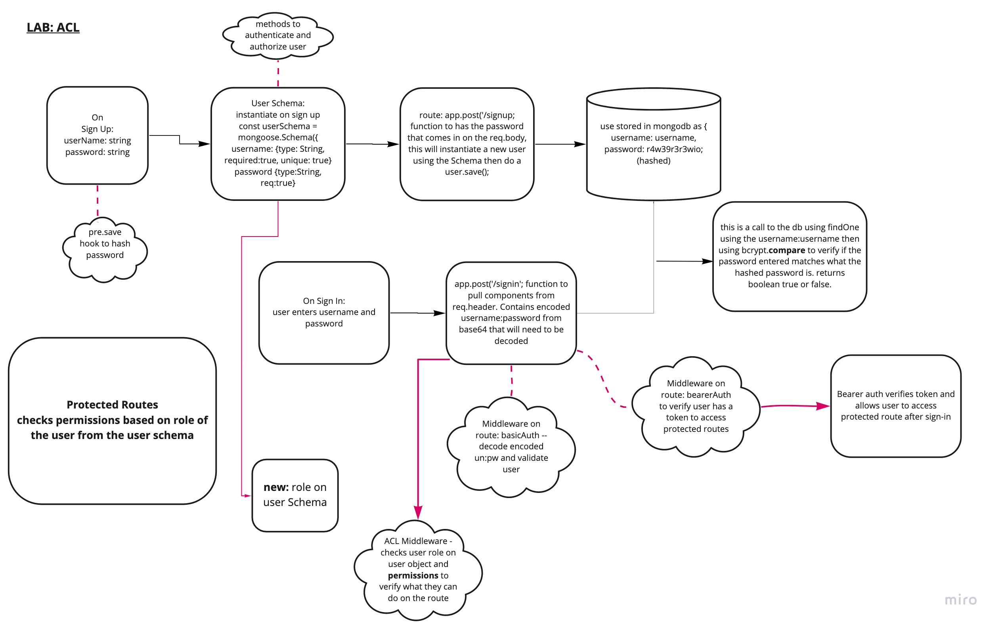

# Lab: Class 08

## Project: auth-api

### Author: Audrey Patterson

## Links and Resources

- [Main Branch deployed to heroku](https://audrey-auth-api.herokuapp.com/)
- [ci/cd](https://github.com/arpatterson31/auth-api/actions)
- [Pull Request dev to main](https://github.com/arpatterson31/auth-api/pull/1)

### Setup

#### `.env` requirements (when applicable)

i.e.

- `PORT` - 3333

#### How to initialize/run your application (where applicable)

- e.g. `npm start`

#### Tests

- How do you run tests?
  - run `npm test` in the terminal from root
- Any tests of note?
  - auth routes
    - post signup and signin
  - v1 routes
  - v2 routes

#### UML / Application Wiring Diagram

